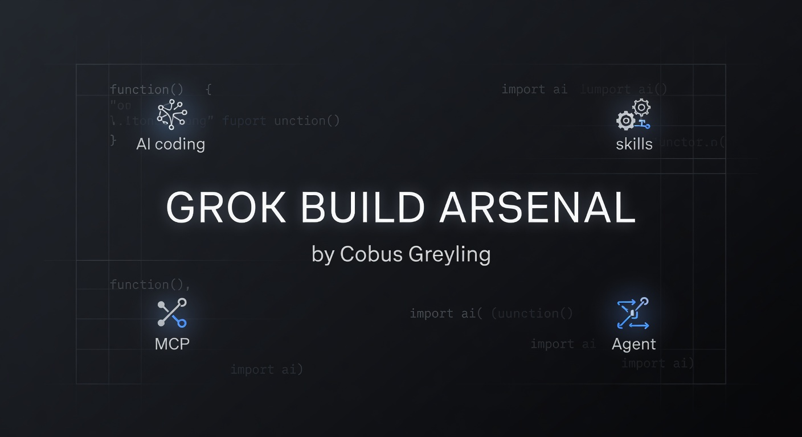

# Grok Build Arsenal

**Web landing page:** https://cobusgreyling.github.io/grok-build-arsenal/


<!-- Social preview for GitHub cards -->


**The definitive production toolkit and living showcase for Grok Build 0.1.**

See what `grok-build-0.1` can actually build when given the right harness, skills, MCP servers, and Plan Mode discipline — then use the same utilities in your own projects.

**Sole author & maintainer: Cobus Greyling**

[](https://x.ai/cli)
[](https://docs.x.ai)
[](LICENSE)
[](skills/)
[](https://github.com/cobusgreyling/grok-build-arsenal/actions/workflows/skill-validate.yml)

---

## Why This Exists

Grok Build 0.1 is xAI’s fast, purpose-built coding model for agentic workflows. It shines with:

- Plan Mode + human approval gates
- Parallel subagents
- Deep MCP (Model Context Protocol) integration
- Headless scripting and custom harnesses via the public API

Most people only see toy demos. **Grok Build Arsenal** ships real, production-minded projects and the exact reusable skills + MCP servers that made them possible.

Everything here was built or refined using Grok Build 0.1 itself.

## Quick Start

```bash
# Clone the arsenal
git clone https://github.com/cobusgreyling/grok-build-arsenal.git
cd grok-build-arsenal

# One-command install of all production skills (into this project or elsewhere)
bash scripts/install-skills.sh

# Inspect everything Grok discovers (skills, rules, hooks, MCPs)
grok inspect

# Start a session (the repo itself is an exemplary Grok Build workspace)
grok
```

Install the skills into any project (frictionless):

```bash
# Recommended: one-command installer
bash /path/to/grok-build-arsenal/scripts/install-skills.sh

# Or target a specific project
bash scripts/install-skills.sh --target /path/to/your-project

# Or install user-wide for all projects
bash scripts/install-skills.sh --global
```

After install:
```bash
grok inspect   # verify skills are loaded
```

Use the public `grok-build-0.1` API directly in your own agents:

```python
from openai import OpenAI

client = OpenAI(
    api_key="xai-...",
    base_url="https://api.x.ai/v1",
)

response = client.responses.create(
    model="grok-build-0.1",
    input="Use the subagent-arena skill pattern to investigate this repo and propose the smallest high-impact PR."
)
```

## Showcase — Real Projects Built with Grok Build 0.1

Each showcase directory contains the original prompts, Plan Mode plans, subagent usage notes, key skills/MCPs used, and transparent build story. The actual shipped code for the flagship lives in a dedicated, polished, installable package (the arsenal is the *playbook + reusable parts*).

### 1. Agent Observability Dashboard (Flagship)
**Build story + MCP:** `showcase/agent-observability-dashboard/`  
**Real production deliverable:** https://github.com/cobusgreyling/agent-failure-analyzer (PyPI: `pip install agent-failure-analyzer`)

Full production CLI + TUI + web dashboard + library for ingesting and deeply analyzing agent sessions from 6+ frameworks. Living failure taxonomy (30+ subcategories), cost waste analysis, risk scoring, Grafana/OTLP, GitHub Action, Docker, PR comment integration, LLM-assisted classification.

**Built with (arsenal in action):** `plan-mode-orchestrator`, `subagent-arena`, custom `agent-session-analyzer` MCP, `tdd-intelligence`, `architecture-reviewer`, `security-audit`, `git-discipline`.

This is the concrete proof that disciplined use of the skills + MCP patterns in this repo ships real, maintained, depended-on tools.

### 2. Subagent Arena Visualizer
**Location:** `showcase/arena-visualizer/`

Interactive TUI + web UI concepts for running parallel subagents on the same task, scoring approaches, and visualizing consensus vs divergence.

- Real-time arena execution
- Structured comparison output
- Cost/latency tracking
- Exportable reports

**Built with:** Heavy subagent orchestration, `subagent-arena` skill, structured outputs, headless mode.

### 3. MCP Control Center
**Location:** `showcase/mcp-control-center/`

A polished control plane vision for discovering, installing, validating, and monitoring MCP servers and skills across projects.

- MCP manifest browser
- One-command install + trust management
- Live health checks
- Skill compatibility matrix

**Built with:** MCP-heavy workflows, `mcp-orchestrator` + `skill-validator` skills, custom browser-qa for UI validation.

### 4. Smart Test Intelligence Engine
**Location:** `showcase/smart-test-engine/`

Production test selection, impact analysis, flakiness detection, and coverage-guided editing for large codebases.

- Predicts which tests matter for a diff
- Runs minimal effective test sets
- Surfaces flaky tests with evidence
- Generates safe edit plans

**Built with:** Deep repo understanding, `test-intelligence` MCP, repeated Plan Mode + verification loops.

## Related Projects & Proof

The skills, MCPs, and discipline in this arsenal are not theoretical. They have already produced real, maintained, installable tools used in production workflows.

### Flagship Delivered Project
- **[agent-failure-analyzer](https://github.com/cobusgreyling/agent-failure-analyzer)** (PyPI: `pip install agent-failure-analyzer`)
  - Full CLI + TUI + web dashboard for AI agent session analysis across 6+ frameworks.
  - Living taxonomy (30+ subcategories), cost waste estimation, risk scoring, OTLP/Grafana export, GitHub Action, Docker, PR comment workflows, LLM-assisted classification.
  - **Build story & MCP:** See `showcase/agent-observability-dashboard/`.
  - **Built with (arsenal in action):** `plan-mode-orchestrator`, `subagent-arena`, `agent-session-analyzer` MCP, `tdd-intelligence`, `architecture-reviewer`, `security-audit`, `git-discipline`.

### In-Arsenal Demos & Prototypes (runnable today)
- **Subagent Arena Visualizer** (`showcase/arena-visualizer/`)
  - `python showcase/arena-visualizer/arena_demo.py` — live, deterministic simulation of the `subagent-arena` skill (3 charters → synthesis → cost tracking).
  - Zero hard deps (rich optional for beauty). Perfect teaching tool and starting point for real arena runners.
- **MCP Implementations**: `agent-session-analyzer`, `repo-graph`, `test-intelligence`, and `skill-validator` now ship with working `server.py` skeletons (see `mcps/*/server.py` and their READMEs). These are the exact patterns used to build the flagship.

### Future / In-Progress (using the same discipline)
- MCP Control Center and Smart Test Intelligence Engine showcases will receive runnable prototypes as they reach the production bar of the flagship.
- New skills and MCPs are added only after they have been used to ship something real (dogfooding).

When you use `bash scripts/install-skills.sh` and follow the skills, you are using the exact same toolkit that produced the above artifacts.

**All original work by Cobus Greyling using Grok Build 0.1 + the patterns documented here.**

## Skills Library

High-signal, narrowly scoped, production-grade skills. All include Plan Mode guidance, subagent patterns, verification steps, and git discipline.

Copy any into `.grok/skills/` in your repo.

| Skill | Description | Trigger |
|-------|-------------|---------|
| `plan-mode-orchestrator` | Master workflow for complex tasks: always start in Plan Mode, decompose, get approval, execute with gates. | "Plan this properly" / "Use plan mode" |
| `subagent-arena` | Run multiple independent subagents on the same question, synthesize, score approaches. | "Run an arena" / "Parallel investigation" |
| `tdd-intelligence` | True test-first development with characterization tests, regression protection, and minimal diff discipline. | "TDD this feature" |
| `mcp-orchestrator` | Discover, evaluate, install, and effectively use MCP servers inside sessions. | "Set up the right MCPs" |
| `git-discipline` | Conventional commits, clean history, PR-ready branches, safe rebasing. | "Prepare this for PR" / "Commit cleanly" |
| `security-audit` | Focused security review for auth, injection, secrets, hook/MCP risks. | "Security review this diff" |
| `architecture-reviewer` | Hexagonal/modular boundaries, data flow, ADRs, reversible change plans. | "Review the architecture" |

See the full catalog in the `skills/` directory.

## MCP Servers

Custom, narrowly-focused MCP servers optimized for agentic coding workflows. These are the highest-leverage additions for Grok Build 0.1 users.

| MCP | Purpose | Key Capabilities |
|-----|---------|------------------|
| `agent-session-analyzer` | Ingest and deeply analyze agent sessions (Grok, Claude, Cursor, etc.) | **Has working server.py + powers the real PyPI package** |
| `repo-graph` | Generate rich architecture and dependency graphs | Has skeleton server.py. Great for architecture-reviewer |
| `test-intelligence` | Smart test selection, impact analysis, flakiness detection | **Now has full skeleton server.py** (predict, run minimal, detect flaky, coverage-guided plans). Pairs with tdd-intelligence. |
| `browser-qa` | Visual + accessibility QA during UI work | Skeleton (pairs great with UI work + tdd-intelligence) |
| `skill-validator` | Validate skills and MCP servers themselves | **Now has full skeleton server.py** (frontmatter, structure, safety audit, report generator). Used by CI and self-validation. |

Each MCP directory contains a README with setup, manifest, example server implementation (where available), and the skill that knows how to drive it. As of v0.2 we now ship working skeletons for `agent-session-analyzer`, `repo-graph`, `test-intelligence`, and `skill-validator`. `browser-qa` remains the thinnest (intentionally narrow scope).

## Project Templates

Ready-to-use project roots with `.grok/` configuration, AGENTS.md, .grokignore, and pre-seeded core skills for common stacks. Copy the folder contents into a fresh project and you're immediately in a high-discipline Grok Build environment.

- `templates/python-fastapi-grok/` — **Richest example.** Full AGENTS.md, .grok/config + hooks + seeded skills, .grokignore. FastAPI + testing + security-first.
- `templates/nextjs-grok/` — Next.js App Router focused starter.
- `templates/rust-cli-grok/` — Rust CLI with testing/release discipline.

After copying:
```bash
bash /path/to/this-arsenal/scripts/install-skills.sh
grok inspect
```

These templates + the installer turn "start a new Grok Build project" into a 30-second operation.

## Using grok-build-0.1 via the Public xAI API

This repo contains examples in `examples/` for calling the model directly (no Grok Build CLI required):

- Python (OpenAI SDK + Responses API)
- TypeScript / AI SDK
- curl examples for headless agent loops
- Subagent orchestration patterns via API

See `examples/api-usage.md`.

## The Repo Itself Is a Grok Build Project

This entire repository is configured as an exemplary Grok Build workspace (and is continuously improved using its own skills):

- Excellent `AGENTS.md` at root (the single source of truth for agent behavior)
- Production skills in `skills/` + `.grok/skills/` (use `bash scripts/install-skills.sh`)
- Custom hooks for reminders (post-edit verification, session start)
- `.grokignore` tuned for agent work (avoids committing huge session logs)
- `grok inspect` is the source of truth
- CI that validates skills, MCP READMEs, the installer, and templates

Clone it, run the installer, `grok inspect`, then `grok`. You will immediately feel the difference high-discipline configuration + skills make.

This repo dogfoods its own patterns (including the changes that made the "showcases" honest and the templates actually usable).

## Author

**Cobus Greyling** — sole author and maintainer.

All original work, skills, MCP designs, showcase projects, and documentation in this repository were created by Cobus Greyling using Grok Build 0.1.

## License

MIT © 2026 Cobus Greyling

## Acknowledgments

- xAI for building `grok-build-0.1` and the Grok Build harness
- The broader agentic coding community for pushing the frontier

---

**Start here:** `grok inspect` → pick a skill or showcase → ship something impressive.

Built with Grok Build 0.1. Maintained by Cobus Greyling.
