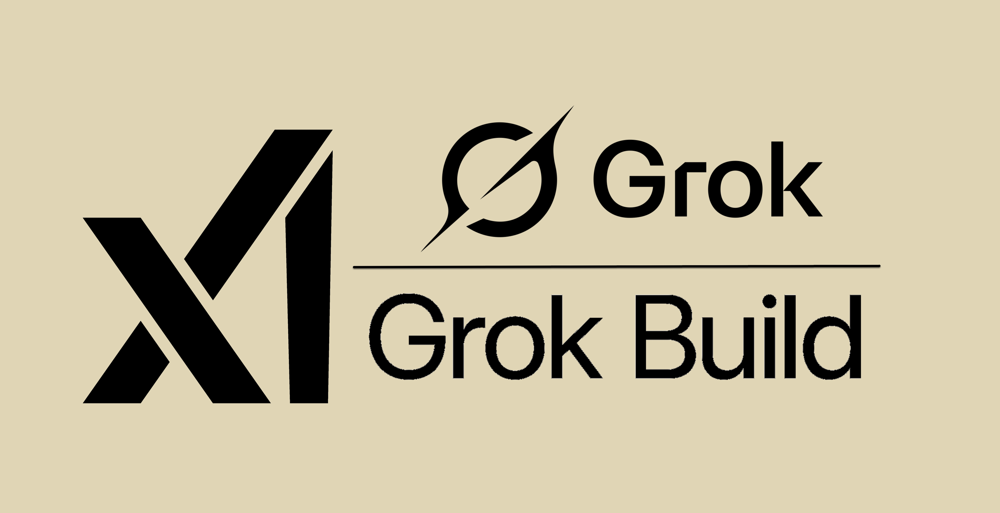

# Grok Build Arsenal



**The definitive production toolkit and living showcase for Grok Build 0.1.**

See what `grok-build-0.1` can actually build when given the right harness, skills, MCP servers, and Plan Mode discipline — then use the same utilities in your own projects.

**Sole author & maintainer: Cobus Greyling**

[](https://x.ai/cli)
[](https://docs.x.ai)
[](LICENSE)
[](skills/)

---

## Why This Exists

Grok Build 0.1 is xAI’s fast, purpose-built coding model for agentic workflows. It shines with:

- Plan Mode + human approval gates
- Parallel subagents
- Deep MCP (Model Context Protocol) integration
- Headless scripting and custom harnesses via the public API

Most people only see toy demos. **Grok Build Arsenal** ships real, production-minded projects and the exact reusable skills + MCP servers that made them possible.

Everything here was built or refined using Grok Build 0.1 itself.

## Quick Start

```bash
# Clone the arsenal
git clone https://github.com/cobusgreyling/grok-build-arsenal.git
cd grok-build-arsenal

# Inspect everything Grok discovers (skills, rules, hooks, MCPs)
grok inspect

# Start a session
grok
```

Install the skills into any project:

```bash
# From this repo
cp -R skills/ /path/to/your-project/.grok/skills/

# Or use the installer (coming soon)
```

Use the public `grok-build-0.1` API directly in your own agents:

```python
from openai import OpenAI

client = OpenAI(
    api_key="xai-...",
    base_url="https://api.x.ai/v1",
)

response = client.responses.create(
    model="grok-build-0.1",
    input="Use the subagent-arena skill pattern to investigate this repo and propose the smallest high-impact PR."
)
```

## Showcase — Real Projects Built with Grok Build 0.1

Each showcase includes the original prompts, Plan Mode plans, subagent usage, key skills/MCPs, and build notes.

### 1. Agent Observability Dashboard
**Location:** `showcase/agent-observability-dashboard/`

A beautiful, self-hosted web dashboard for analyzing AI agent sessions across Grok Build, Claude Code, Cursor, and custom harnesses.

- Session ingestion and fingerprinting
- Failure taxonomy + heatmaps
- Cost and token attribution
- Replay and diff views
- OTLP export + Grafana integration

**Built with:** Plan Mode, 3 subagents (log parser, classifier, visualizer), custom `agent-session-analyzer` MCP, `tdd-intelligence` skill.

**Result:** Full working dashboard + CLI + exporters shipped in focused sessions with clean git history.

### 2. Subagent Arena Visualizer
**Location:** `showcase/arena-visualizer/`

Interactive TUI + web UI for running parallel subagents on the same task, scoring approaches, and visualizing consensus vs divergence.

- Real-time arena execution
- Structured comparison output
- Cost/latency tracking
- Exportable reports

**Built with:** Heavy subagent orchestration, `subagent-arena` skill, structured outputs, headless mode.

### 3. MCP Control Center
**Location:** `showcase/mcp-control-center/`

A polished control plane for discovering, installing, validating, and monitoring MCP servers and skills across projects.

- MCP manifest browser
- One-command install + trust management
- Live health checks
- Skill compatibility matrix

**Built with:** MCP-heavy workflows, `mcp-orchestrator` + `skill-validator` skills, custom browser-qa for UI validation.

### 4. Smart Test Intelligence Engine
**Location:** `showcase/smart-test-engine/`

Production test selection, impact analysis, flakiness detection, and coverage-guided editing for large codebases.

- Predicts which tests matter for a diff
- Runs minimal effective test sets
- Surfaces flaky tests with evidence
- Generates safe edit plans

**Built with:** Deep repo understanding, `test-intelligence` MCP, repeated Plan Mode + verification loops.

## Skills Library

High-signal, narrowly scoped, production-grade skills. All include Plan Mode guidance, subagent patterns, verification steps, and git discipline.

Copy any into `.grok/skills/` in your repo.

| Skill | Description | Trigger |
|-------|-------------|---------|
| `plan-mode-orchestrator` | Master workflow for complex tasks: always start in Plan Mode, decompose, get approval, execute with gates. | "Plan this properly" / "Use plan mode" |
| `subagent-arena` | Run multiple independent subagents on the same question, synthesize, score approaches. | "Run an arena" / "Parallel investigation" |
| `tdd-intelligence` | True test-first development with characterization tests, regression protection, and minimal diff discipline. | "TDD this feature" |
| `mcp-orchestrator` | Discover, evaluate, install, and effectively use MCP servers inside sessions. | "Set up the right MCPs" |
| `git-discipline` | Conventional commits, clean history, PR-ready branches, safe rebasing. | "Prepare this for PR" / "Commit cleanly" |
| `security-audit` | Focused security review for auth, injection, secrets, hook/MCP risks. | "Security review this diff" |
| `architecture-reviewer` | Hexagonal/modular boundaries, data flow, ADRs, reversible change plans. | "Review the architecture" |

See the full catalog in the `skills/` directory.

## MCP Servers

Custom, narrowly-focused MCP servers optimized for agentic coding workflows. These are the highest-leverage additions for Grok Build 0.1 users.

| MCP | Purpose | Key Capabilities |
|-----|---------|------------------|
| `agent-session-analyzer` | Ingest and deeply analyze agent sessions (Grok, Claude, Cursor, etc.) | Failure taxonomy, cost attribution, fingerprinting, replay |
| `repo-graph` | Generate rich architecture and dependency graphs | Module boundaries, call graphs, visual + textual output |
| `test-intelligence` | Smart test selection and impact analysis | Minimal test sets, flakiness detection, coverage guidance |
| `browser-qa` | Visual + accessibility QA during UI work | Screenshots, console capture, a11y checks, diffing |
| `skill-validator` | Validate skills and MCP servers themselves | Frontmatter checks, safety analysis, test harness |

Each MCP directory contains a README with setup, manifest, example server implementation, and the skill that knows how to drive it.

## Project Templates

Ready-to-use `.grok/` configurations for common stacks:

- `templates/nextjs-grok/` — Next.js App Router with server/client boundaries, testing, and deployment rules
- `templates/python-fastapi-grok/` — FastAPI + SQLAlchemy + pytest + security-first setup
- `templates/rust-cli-grok/` — Rust CLI with strong testing, error handling, and release discipline

Copy the entire template folder into a new project and run `grok inspect`.

## Using grok-build-0.1 via the Public xAI API

This repo contains examples in `examples/` for calling the model directly (no Grok Build CLI required):

- Python (OpenAI SDK + Responses API)
- TypeScript / AI SDK
- curl examples for headless agent loops
- Subagent orchestration patterns via API

See `examples/api-usage.md`.

## The Repo Itself Is a Grok Build Project

This entire repository is configured as an exemplary Grok Build workspace:

- Excellent `AGENTS.md` at root
- Multiple production skills in `.grok/skills/`
- Custom hooks for formatting and safety
- `.grokignore` tuned for agent work
- `grok inspect` is the source of truth

Run it yourself to see how a high-discipline Grok Build project feels.

## Author

**Cobus Greyling** — sole author and maintainer.

All original work, skills, MCP designs, showcase projects, and documentation in this repository were created by Cobus Greyling using Grok Build 0.1.

## License

MIT © 2026 Cobus Greyling

## Acknowledgments

- xAI for building `grok-build-0.1` and the Grok Build harness
- The broader agentic coding community for pushing the frontier

---

**Start here:** `grok inspect` → pick a skill or showcase → ship something impressive.

Built with Grok Build 0.1. Maintained by Cobus Greyling.
